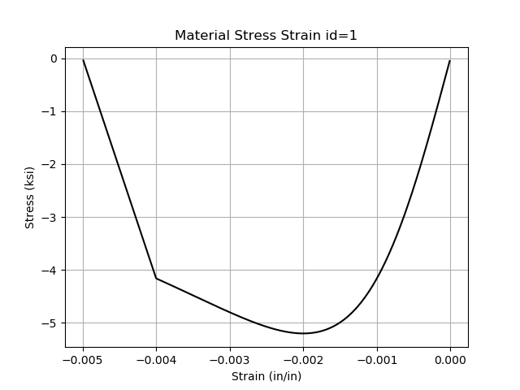
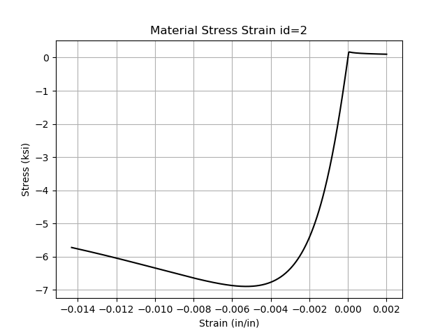
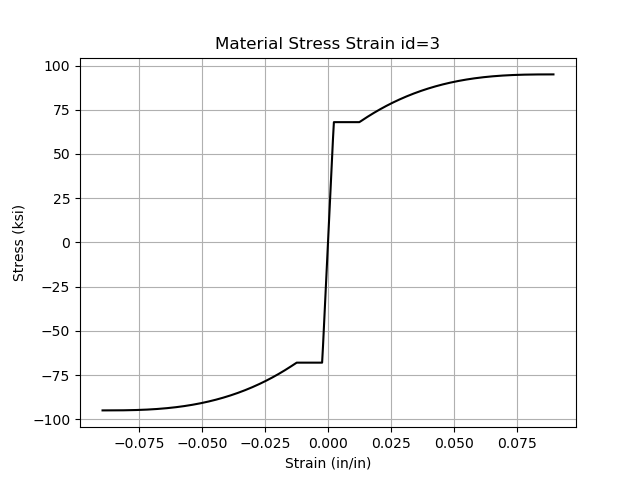
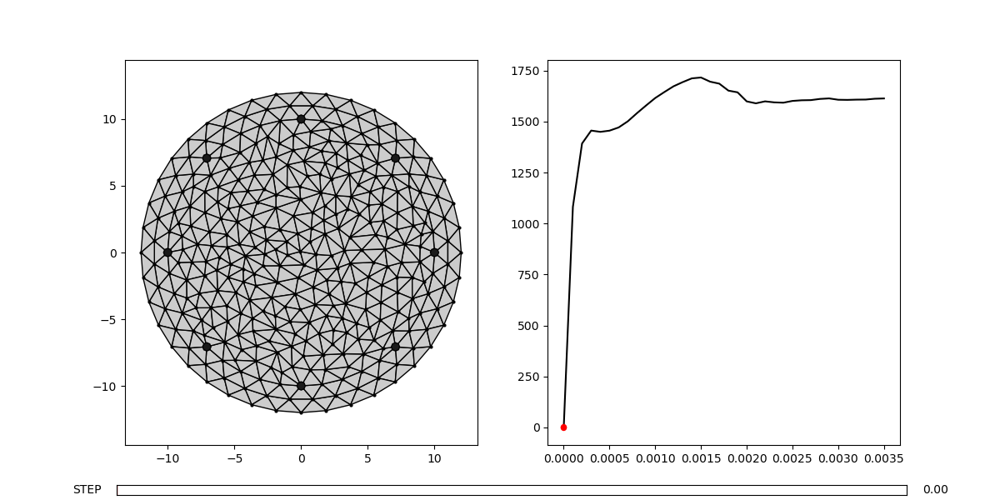

# OSFyber

Structural engineering tool to perform 2D moment curvature analysis of cross sections.

Currently in pre-alpha. Still implementing features in to-do, generalizing code, and fixing bugs.

## Installation

For the actively developed version:

$ pip install git+https://github.com/NathanaelRea/OSFyber

## Examples

# 1 Standard circular section with low confinemenet

    ```
	from osfyber.system import FyberModel

	### CREATE A MODEL (default mesh size is 2 in^2)
	model = FyberModel(mesh_size=1)

	### Set Materials
	model.add_material(id=1, type='concrete', fpc=4, ecp=-.002219, ecu=-.005)
	fple = model.conf_pressure('circle', fyh=60, bar=3, D=20, s=12)
	model.add_material(id=2, type='concrete', fpc=4, fple=fple)
	model.add_material(id=3, type='user', points=[[.002069,60],[.01,60],[.0189,70],[.0456,80],[.09,90],[.108,37.8]], mirror=True)

	### Set Geometry
	model.add_geometry('circle', mat_id=1, c=(0,0), D=24)

	### Set longitudinal reinforcmenet, and optinally confinement
	model.add_reinforcement('circle', mat_id=3, D=20, c=(0,0), bar=5, count=8, conf_id=2)

	### GENERATE MESH
	model.generate_mesh()

	### Display Material Stress Strain Plots and Generated Mesh
	#model.display_mat()
	#model.display_mesh()

	### ANALYZE MODEL
	model.analyze()

	### DISPLAY MOMENT CURVATURE
	model.display_mc()
	```










## TODO

Documetation
Export/save points from moment curvature
Generate facets from round trip of multiple section (python module for union/subtraction of polygons, then mesh)
Possibly Implement robbievanleeuwen/section-properties for ease of mesh manipulation
Colors on material display so it makes more sense
MIN/MAX strain in each material class - for plotting and indication of failure point

LESS IMPORTANT
Ability to Change units
Remesh confiment to more closely represent spalling (not sure if would actually would capture experimental behavior better)
Click on patch in MC plot and see current strain/stress plot with marker on current
Ability to change material color indicators