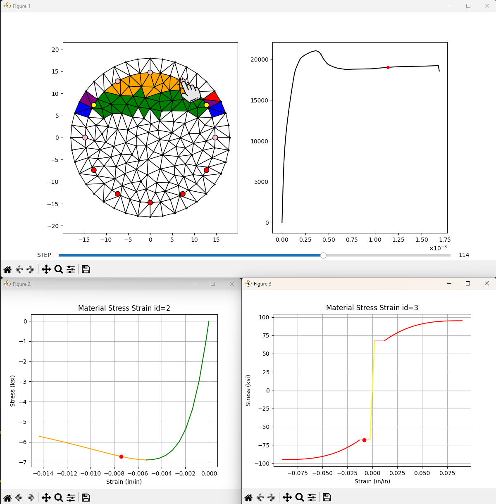

# OSFyber

Open Source 'Fyber' Analysis Tool for Moment Curvature.


## Installation

- uv init
- uv add git+<https://github.com/NathanaelRea/OSFyber>

## Examples

### Confined Circular Column

[circular_column.py](/tests/circular_column.py)

Output from analyze():

```text
Analysis ended at phi=0.0017
Failure: Confined Concrete Crushing
    Max Available Strain=-0.01432
    Strain Experienced=-0.01512
    Mat_id=2
    Location=[3.281, 13.664]
```

Fully Interactive Moment Curvature Diagram. Ability to step through process of degradation. Can also click on a mesh to see internal properties. Can use Mouse on either plot to view (x,y) values in bottom right.

Output from display_mc():


You can click on the mesh to view stress strain plot at that step:


