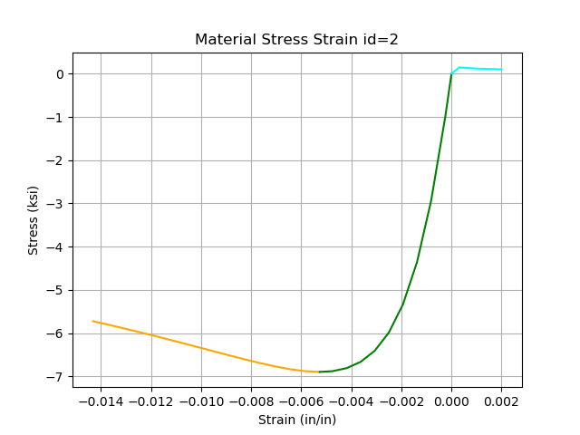

# OSFyber

Open Source 'Fyber' Analysis Tool for Moment Curvature.

Currently in pre-alpha. Still implementing features in todo, generalizing code, and fixing bugs.

Check out the current development and future updates: [Trello](https://trello.com/b/FFrJVfhk/osfyber)


## Installation

Directly install the master branch:

```
$ pip install git+https://github.com/NathanaelRea/OSFyber
```

Or just download the zip from github and use pip install on the extracted folder.

## Examples

### Standard Confined Circular Column

```python
from osfyber.system import FyberModel

# CREATE A MODEL
model = FyberModel()

# Set Materials
model.add_material(mat_num=1, mat='concrete', fpc=5.2, ecp=-.002, ecu=-.005)
fple = FyberModel.conf_pressure('circle', fyh=68, bar=4, D=31.5, s=3)
model.add_material(mat_num=2, mat='concrete', fpc=5.2, fple=fple)

model.add_material(mat_num=3, mat='steel', E=29565, fy=68, fsu=95, e_sh=0.0125, e_su=0.09, P=2.8)

# SET GEOMETRY
model.add_geometry('circle', mat_id=1, c=(0, 0), D=36)

# SET LONGITUDINAL REINFORCEMENT (OPTIONAL CONFINEMENT)
model.add_reinforcement('circle', mat_id=3, D=29.5, c=(0, 0), bar=9, count=12, conf_id=2)

# ADD LOADING (Positive is Compression)
model.set_load('Axial', P=1000)

# GENERATE MESH
model.generate_mesh()

# CHECK INPUT
model.display_materials()
# model.display_mesh()

# ANALYZE MODEL
model.analyze()

# SAVE RESULTS
# model.export_results()

# DISPLAY MOMENT CURVATURE
model.display_mc()
# model.display_mc_2x2()
```

Output from display_materials():





Output from analyze():

```
Analysis ended at phi=0.0017
Failure: Confined Concrete Crushing
	Max Available Strain=-0.01432
	Strain Experienced=-0.01512
	Mat_id=2
	Location=[3.281, 13.664]
```

Fully Interactive Moment Curvature Diagram. Ability to use the slider to step through all the states. Can also click on a mesh to see internal properties. Can use Mouse on either plot to view (x,y) values in bottom right.

Output from display_mc():


(In Current Development - 2x2 Plot of Section, Moment Curvature, Strain Diagram, Stress Diagram)

Output from display_mc_2x2():


