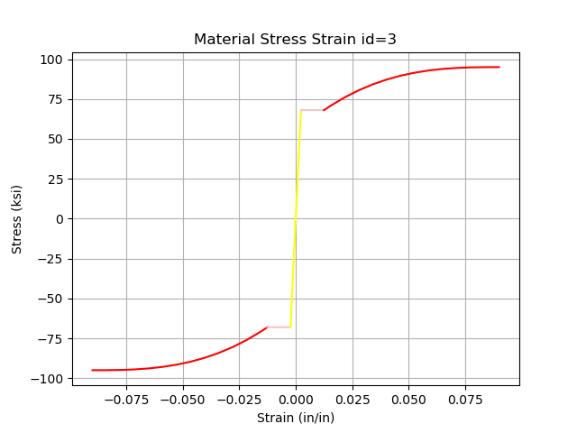

# OSFyber

Open Source 'Fyber' Analysis Tool for Moment Curvature.


## Installation

- Ensure you have MS build tools for MeshPy
  - <https://visualstudio.microsoft.com/visual-cpp-build-tools>
- Initialize Poetry project
  - `poetry init`
- Add directly from repo url
  `poetry add git+https://github.com/NathanaelRea/OSFyber`

## Examples

### Standard Confined Circular Column

```python
from osfyber.materials import (
    ConfinedConcreteProps,
    ConfinedPressureCircleProps,
    SteelProps,
    UnconfinedConcreteProps,
    conf_pressure_circle,
)
from osfyber.system import (
    CircleGeometryProps,
    FyberModel,
    LoadProps,
    ReinforcementProps,
)

model = FyberModel()

# Set Materials
unconfined_concrete = model.add_material_concrete(
    UnconfinedConcreteProps(fpc=5.2, ecp=-0.002, ecu=-0.005)
)
fple = conf_pressure_circle(
    ConfinedPressureCircleProps(fyh=68, bar_number=4, D=31.5, s=3)
)
confined_concrete = model.add_material_confined_concrete(
    ConfinedConcreteProps(fpc=5.2, fple=fple)
)
steel = model.add_material_steel(
    SteelProps(E=29565, fy=68, fsu=95, e_sh=0.0125, e_su=0.09, P=2.8)
)

# set geometry
model.add_geometry_circle(unconfined_concrete, CircleGeometryProps(D=36, c=(0, 0)))

# Set reinforcement
model.add_reinforcement_circle(
    steel,
    CircleGeometryProps(D=29.5, c=(0, 0)),
    ReinforcementProps(bar=9, count=12, conf_id=2),
)

# Add loading (positive is compression)
load = LoadProps(P=1000)
model.set_load(load)

# Generate mesh
model.generate_mesh()

# Check input
# model.display_materials()
# model.display_mesh()

model.analyze()
model.display_mc()
# model.display_mc_2x2()

# save results
# model.export_results()
```

Output from display_materials():




Output from analyze():

```text
Analysis ended at phi=0.0017
Failure: Confined Concrete Crushing
    Max Available Strain=-0.01432
    Strain Experienced=-0.01512
    Mat_id=2
    Location=[3.281, 13.664]
```

Fully Interactive Moment Curvature Diagram. Ability to step through process of degradation. Can also click on a mesh to see internal properties. Can use Mouse on either plot to view (x,y) values in bottom right.

Output from display_mc():


